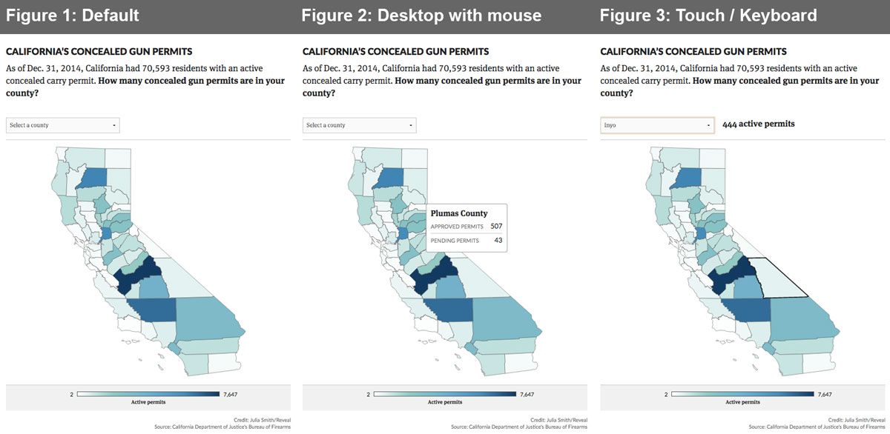

# Pre-Production Checklist
* Is it [**responsive**](#responsive)?
* Does is have special features for [**touch devices**](#touch-support)?
* Are [**hit areas**](#hit-areas) appropriately sized?
* Are [**alternative selection mechanisms**](#alternative-selection-mechanisms) in place?
* Is there a [**noscript fallback**](#noscript-fallback) for old browsers?
* Is all information [**accessible via keyboard**](#keyboard-support)?
* Are there [**visible states**](#visible-states) for focus/hover/selected?
* Is there a [**fallback for tooltips**](#tooltip-alternative)?
* Are [**tables**](#table-accessibility) legible and accessible?
* How did it perform on [**PageSpeed**](#pagespeed-evaluation)?
* Is it error-free on [**WAVE**](#wave-evaluation)?

<hr />
##Responsive:
* Test the graphic on as many devices as possible and make sure it flows appropriately and doesn't break out of the viewport.
* Use the viewport meta tag in your HTML. 

        <meta name="viewport" content="width=device-width, initial-scale=1">
 * More on sizing content: [Viewport Meta Tag](https://developer.mozilla.org/en-US/docs/Mozilla/Mobile/Viewport_meta_tag) | Mozilla Developers
* Use CSS media queries.

        @media all and (max-width: 768px) {}
 * More on media queries: [Media Queries for Standard Devices](https://css-tricks.com/snippets/css/media-queries-for-standard-devices/) | CSS Tricks
* More on RWD fundamentals: [Responsive Web Design Basics](https://developers.google.com/web/fundamentals/layouts/rwd-fundamentals/index?hl=en) | Google Developers

<hr>
##Touch Support:
* Some interactives may require specific enhancements for touch devices.
 * Example: Disable mouse events on a map and use a native control, like a select box, instead. ([How?](##alternative-selection-mechanisms))
* To isolate UI elements and interactions for touch devices, test for mobile **user agent strings** and add a CSS class to the containing element. This way you can use touch-only CSS and JS selectors.

        var touch;
        if (/Android|webOS|iPhone|iPad|iPod|BlackBerry/i.test(navigator.userAgent)) {
            touch = true;
            var wrapper = document.getElementById('interactive-wrapper');
            wrapper.className += ' touch-device';
        }
The above JS snippet tests for the user agent and – if it's a touch device – sets the variable ```touch``` to ```TRUE``` and adds the class ```touch-device``` to the interactive's container. This way you can write touch-only CSS like below, which will increase the size of an SVG circle on touch devices:
    
        .touch-device circle {  
          r: 30;
          stroke-width: 8;
        }
    You can also now write JS like below, which will only add event listeners for mouse actions if the user is *not* on mobile:

        if (!touch){
          elem.addEventListener( 'mouseover', function(e) {
            tooltipInfo(e.target);
            tooltip.style.display = 'block';
          });
          elem.addEventListener( 'mouseout', function() {
            tooltip.style.display = 'none';
          });
        } 
* More on designing for touch: [Fingers, thumbs, and people](http://interactions.acm.org/archive/view/may-june-2015/fingers-thumbs-and-people) | Steven Hoober

<hr>
##Hit Areas:
* Tap targets should be large enough to touch on mobile – at least 30x30 pixels or so.
* Links and tap targets should be spaced appropriately so users won't accidentally hit the wrong link.
* Use media queries to make the necessary adjustments to your design. (See [Responsive](#responsive) above.)
* For some graphics (like SVG maps) that are scaled down by device width, hit areas will become too small on certain devices. To compensate:
 * Provide a different means to access the data. (See [Alternative Selection Mechanisms](#alternative-selection-mechanism) below.)
 * **Don't disable pinch-zoom!** Ensure your users can zoom in on a desired area of your graphic.
* Lively discussion on pinch-zoom: [Disabling Pinch Zoom on Mobile Web](http://stackoverflow.com/questions/11689353/disable-pinch-zoom-on-mobile-web) | StackOverflow
* More on hit areas: [Finger-Friendly Design](http://www.smashingmagazine.com/2012/02/21/finger-friendly-design-ideal-mobile-touchscreen-target-sizes/) | Smashing Magazine

<hr>
##Alternative Selection Mechanisms:
* If your graphic includes a custom way to access data, also provide a native control (select box, radio buttons, etc.) so your user can access the data in your interactive more easily via keyboard or their mobile device.


* In the above example, data embedded in the map is available both by hovering over a county *and* by using the select box to pick a county. This accomplishes two things:
 * It makes the data accessible via keyboard.
 * It allows geographicaly small counties (like San Francisco County) to be more easily selected on mobile devices.
* The tricky part is keeping the two selection mechanisms (the map and the select box) in sync. Here are the functions that operate the select box:

        function countySelect(){
		  var select = document.getElementById("cir-map-select");
		  select.onchange = function(){
		    var value = select.value;
		    updateSelectionInfo(value);
		  }
		}

		function updateSelectionInfo(value){
		  var info = document.getElementById("cir-map-info");
		  if (value != "Select a county"){
		    var svgCounty = document.getElementById(value);
		    var dataCounty = svgCounty.getAttribute("data-name");
		    var dataApproved = svgCounty.getAttribute("data-approved").toString().replace(/\B(?=(\d{3})+(?!\d))/g, ",");
		    var html = "<div class='info-inner'><span class='county-group'>" + dataApproved + " active permits</span></div>";
		    info.innerHTML = html;
		    updateSelectedPath(svgCounty);     
		  } else {
		    info.innerHTML = "";
		    deselectPath();
		  }
		}

		function updateSelectedPath(path){
		  deselectPath();   
		  if (path.getAttribute('data-selected') == 'true'){
		    path.setAttribute('data-selected', 'false');
		  } else {
		    path.setAttribute('data-selected', 'true');
		  } 
		  path.setAttribute('data-selected', 'true');
		  var parent = path.parentNode;
		  parent.appendChild(path);
		}

		function deselectPath(){
		  var selected = document.querySelector('.cir-county[data-selected="true"]');
		  if (selected) {
			  selected.setAttribute('data-selected', 'false');
		  }
		}
    
    Then the map paths also update the select box:

        elem.addEventListener( 'click', function(e) {
            var countyID = e.target.id;
            var select = document.getElementById("cir-map-select");           
            if (e.target.getAttribute('data-selected') == 'true'){
              select.value = "Select a county";
              e.target = "";
              countyID = "Select a county";
            } else {
              select.value = countyID;
            }
            updateSelectedPath(e.target);
            updateSelectionInfo(countyID);
        }); 
<hr>
##Noscript Fallback:

<hr>
##Keyboard Support:

<hr>
##Visible States:

<hr>
##Tooltip Alternative:

<hr>
##Table Accessibility:

<hr>
##PageSpeed Evaluation:

<hr>
##WAVE Evaluation:

